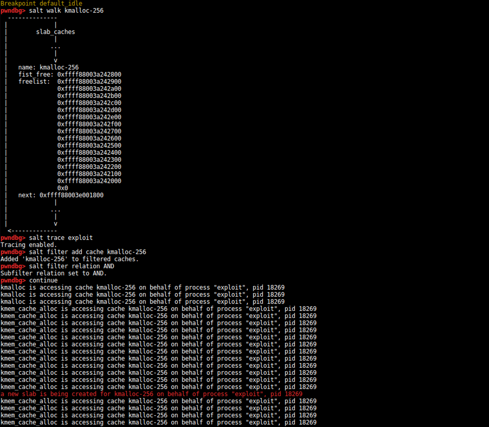

Welcome to ***salt***, a tool for kernel heap memory reversing.

This project is implemented as a gdb plugin that helps analyze and trace the state of the SLUB allocator in modern linux kernels.   
This can be useful when developing an exploit, or even debugging your own kernel code.

While working on the tool, I also developed a loadable kernel module that can trigger allocations and deallocations at will, to serve both as a debugging tool and a playground to better understand the inner workings of the allocator system.

More information about using the tool and replicating the experiments can be found in the [docs](docs) folder.

 Developed at [EURECOM](http://www.eurecom.fr/en) as the semester project for Spring 2018.  
Many thanks to my supervisor [Yanick](https://www.eurecom.fr/fr/people/fratantonio-yanick) and to the rest of the [S3 team](http://s3.eurecom.fr) that helped and followed me.

## Presentation

As part of my project, I also gave a presentation to the security team of EURECOM. The slides are available [here](XXX).

## Sources

[Perla E, Oldani M (2010) - A Guide to Kernel Exploitation: Attacking the Core](https://books.google.com/books?id=G6Zeh_XSOqUC&printsec=frontcover)

[Christopher Lameter - Slab allocators in the linux kernel](https://events.static.linuxfound.org/sites/events/files/slides/slaballocators.pdf)

[th7.cn](http://www.th7.cn/system/lin/201701/200668.shtml)
